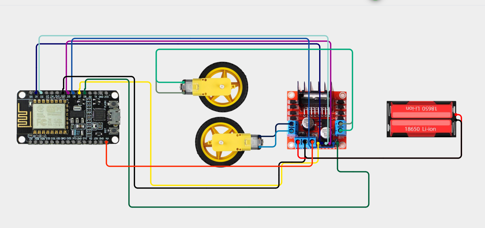
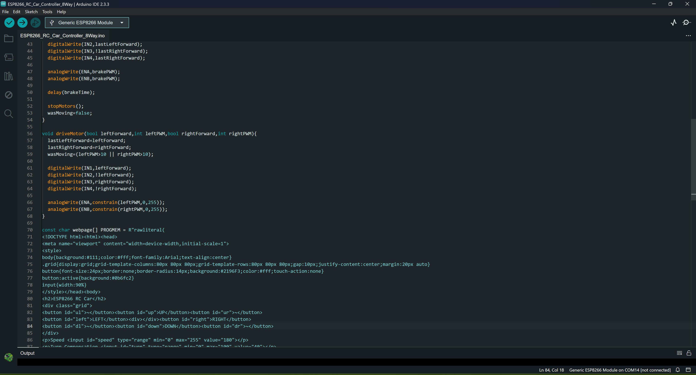
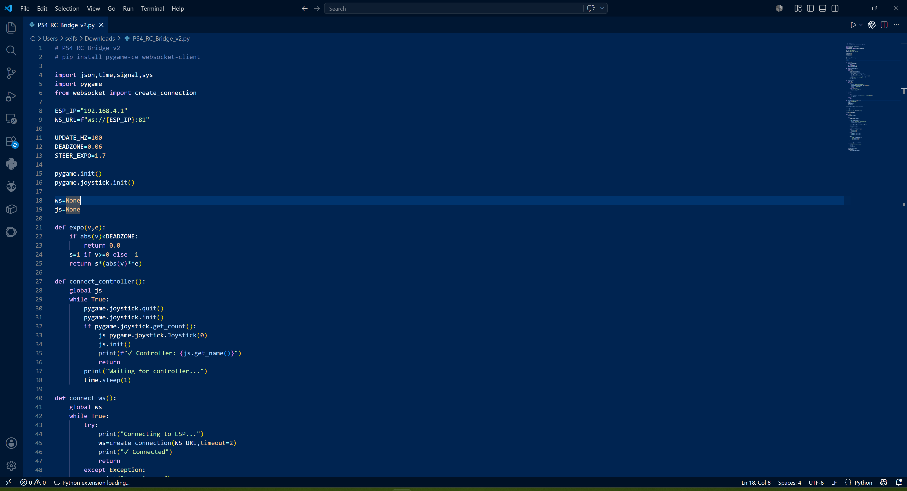
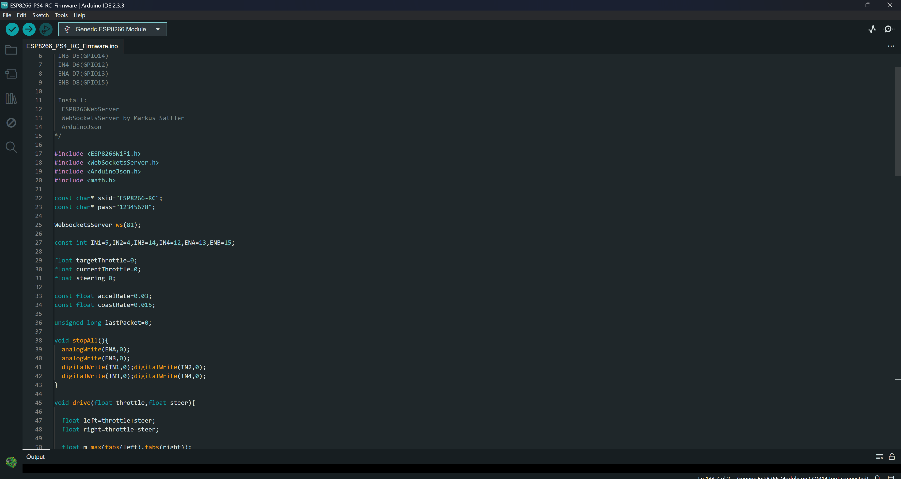

# Project Started

I started this project to learn more about robotics, embedded systems, and RC vehicle design. Instead of purchasing a ready-made RC car, I wanted to build one from individual components so I could understand both the hardware and software behind it. My long-term goal is to use this project as the foundation for a more advanced Formula One inspired RC car.

**Total time spent: 0.5 hours**

## Pinout

| L293N | ESP8266 |
|-------|---------|
| IN1 | D1 (GPIO5) |
| IN2 | D2 (GPIO4) |
| IN3 | D5 (GPIO14) |
| IN4 | D6 (GPIO12) |
| ENA | D7 (GPIO13) |
| ENB | D8 (GPIO15) |

**Total time spent: 0.5 hours**

# First Firmware

The first firmware created a Wi-Fi access point so a phone could connect directly to the ESP8266. I designed a browser interface containing a virtual joystick together with speed, steering compensation, and braking controls. This version successfully demonstrated wireless motor control and verified that the electronics were working correctly.

**Total time spent: 2 hours**

# Improving the Controls

The touchscreen joystick was replaced with an eight-direction control pad. Although this was easier to use, it still did not provide the precision I wanted. After experimenting with the browser controls, I decided to move to a real PlayStation 4 controller for a much better driving experience.

**Total time spent: 1.5 hours**

# PS4 Controller Integration

Instead of connecting the controller directly to the ESP8266, I created a Python bridge application. The bridge detects the PlayStation 4 controller, reads the analog sticks and triggers, and sends steering and throttle information to the ESP8266 using WebSockets. This approach made the controls much smoother and easier to expand in the future.

Current controls:

| Control | Function |
|---------|----------|
| Left Stick X | Analog steering |
| R2 | Analog forward throttle |
| L2 | Analog brake and reverse |

**Total time spent: 1.5 hours**

# Firmware Improvements

The firmware was improved with smooth acceleration, smooth deceleration, analog steering, analog throttle, analog braking, differential motor mixing, and a communication fail-safe that stops the motors if the connection is lost. Considerable time was also spent debugging Wi-Fi connectivity, firmware uploads, and WebSocket communication.

**Total time spent: 2.5 hours**

# Current Status

The project is now functioning as a software development platform for future improvements. The next major goal is replacing skid steering with a steering servo. Future upgrades will include a better motor driver, battery voltage monitoring, telemetry, an ESP32 version, and eventually transferring everything into a Formula One inspired chassis.

Planned upgrades:

- Steering servo
- Better motor driver (TB6612FNG or DRV8833)
- Battery voltage monitoring
- Telemetry
- ESP32 version
- Formula One chassis
- Brushless motor support

